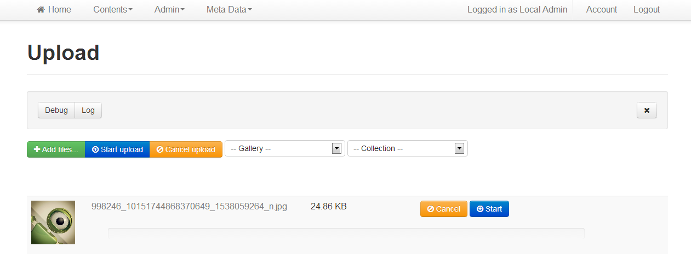
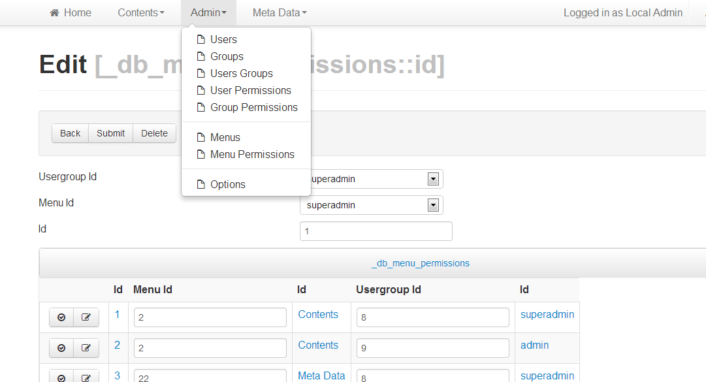

Laravella 
==========

Laravel 4 Admin console, CMS and starter project.  Hit the ground running with the most useful packages installed and integrated.

Github
-------------------
+ [Project Home](https://github.com/laravella/laravella)
+ [Documentation](http://laravella.github.io/docs/)
+ [Download](https://github.com/laravella/laravella/archive/master.zip) 
+ [Issues and Questions](https://github.com/laravella/laravella/issues)

Included
-------------------
###cborgia/radiate
HTML5 Boiler Plate, Twitter Bootstrap, Font Awesome, SASS, and a quick little login/register script to get you started.

###laravella/ravel
CMS built with Angular.js. Forked from raftalks\ravel but using Twitter Bootstrap style.

###laravella/crud
Database Create, Read, Update, Delete package.  laravella/crud also makes provision for custom views and and AJAX friendly api so that you can basically achieve anything you want with it.

###laravella/cart
A demo shopping cart built on laravella/crud (just an example project).

###laravella/package
A starter package for laravel. Includes a facade, artisan commands, IoC class, migrations and database seed examples.

###laravella/cms
A content management system and blog built on crud.  It supplements laravella/ravel at the moment but will eventually replace it.

###laravella/uploader
A sweet file uploader from [blueimp](https://github.com/blueimp/jQuery-File-Upload) packaged for laravel and integrated into Laravella/CMS.

<h2 id="screenshots">Screenshots</h2>

Quick start guide
-------------------
1. **Download** the laravella project (Git clone or zip extract)
2. **Run : composer update** (or : php composer.phar update)
3. You should have a database server running and a target database created.
4. **Edit database details** in /app/config/database.php.
5. **Add providers** in /app/config/app.php : 
> `'providers' => array(...`  
> `'Laravella\Ravel\RavelServiceProvider',`  
> `'Laravella\Crud\CrudServiceProvider',`  
> `'Laravella\CMS\CMSServiceProvider',`  
> `'Laravella\Uploader\UploaderServiceProvider')`
6. **Initialize the database** with `php artisan ravel:install`
7. **Generate metadata** with `php artisan crud:install`
8. **Add uploader to admin menu** with `php artisan uploader:install`
9. You can start a development server with : `php artisan serve --port 80` from the command line
10. Browse to :
> <http://localhost> for the frontend  
> <http://localhost/admin> for the cms console  
> <http://localhost/db/select/_db_tables> for crud console   
> <http://localhost/db/select/{tablename}> to edit an existing table   
> Default username is **admin** and password is **ravel**
11. Run `php artisan crud:install` again to regenerate meta data after you've added or altered tables.

API Docs
-------------------
+ Laravella
+ [Cart](apidocs/cart/index.html)
+ [Crud](apidocs/crud/index.html)
+ Ravel
+ CMS
+ Package
+ Uploader

License
-------------------
<http://opensource.org/licenses/MIT>

What's new
-------------------
4.1.008  
File uploader included

4.1.007  
Options and option categories

4.1.006  
dynamic menus